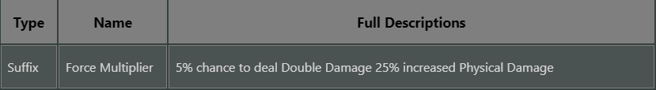
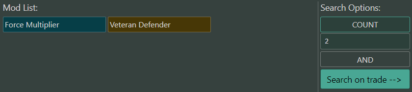
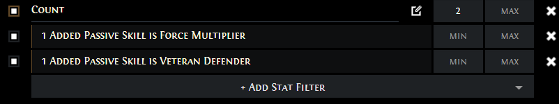
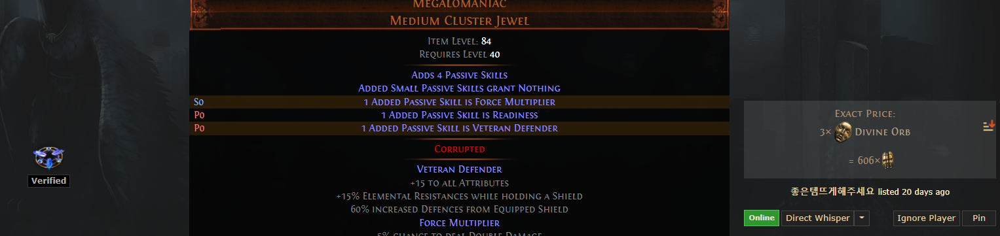

<!-- PROJECT LOGO -->
 

  
  <h2 align="center">Megalomaniac Noteable Finder</h2>

  <!-- CALL TO ACTION -->
  

    Find your desired mods for your search easily. 
     
    <a href="https://poe-megalomaniac-for-trade-6zlk45e80-ipatrikxz.vercel.app">View Demo</strong></a>
     
     
    <a href="https://github.com/ipatrikxz/PoE-Megalomaniac-for-trade/issues">Report Bug</a>
    -
    <a href="https://github.com/ipatrikxz/PoE-Megalomaniac-for-trade/issues">Request Feature</a>
  

<!-- ABOUT THE PROJECT -->
## About The Project

The purpose of this project is to summarize all the Noteable jewel mod names and descriptions in one page that you can search through.

## Usage
  - Type keywords into the search bar, it will search through the names and descriptions
  - Click on a row that you want to add to the list
  - You can delete from your list by simply clicking on the mod at the top of the page
  - Select a search type 
  - Click the "Search on trade" - This will generate a search query based on your selected mods and open it in the offical trade site in a seperated window. 

## Features

  - Quick searchable list of mod names and thier descriptions.
  - Selectable mods, make your own list of mods
  - Search types like on the offical trade site (AND, COUNT)
  - Generate search query for the offical PoE trade site based on your list and search type

## Screenshots
  

    
    
    
    
  

## Built With

 

(<a href="#readme-top">back to top</a>)
